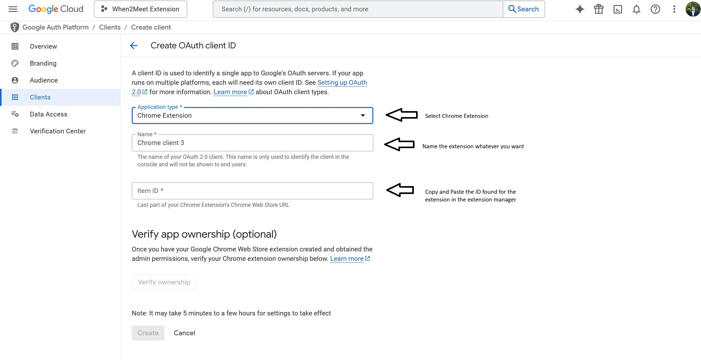

# When2MeetAutofill

This is a project to automate the annoying process of filling out When2Meets by constantly switching between my google calendar and the page. When2MeetAutofill is a google chrome extension that autofills any when2meet at the click of a button for you!

All you have to do is click on the extension and click autofill for the script to fill out a when2meet. It will only work if you have logged into the when2meet prior. The checkboxes can be used to chose which individual calendars will be read and autofilled.

The API calls for google calendar are completely free so there is absolutely no cost to this project whatsoever.

Setup: 
1. First clone the repo into whatever directory you want

2. Open up google chrome and go to your extensions and at the bottom of the popup click "Manage Extensions"
    - In the extension manager click "Load Unpacked" in the top left of the dialog 
    - Select the when2meetautofill directory where you cloned the repo
    - After loading the extension leave the extension manager open so we can go back to it

3. Now we need to create a project using the Google Cloud Console. Follow these instructions to create one:
    https://developers.google.com/workspace/guides/create-project

4.  Next we need to set up our environment and create a client Id:
    -  Click on the navigation menu in the top loft 
    -  Click on credentials and select "OAuth Client Id"
    -  In the new dialog that opens up select "Chrome Extension" and then proceed to the next step without clicking anything else for now
    

5. Go back to the extension manager and copy the Extension Id found under the newly unpacked extension we just made:


6. Fill out the fields as specified below:
    
    - When done click "Create"

7. Now copy the client Id found when you create the new OAuth Client and open the manifest JSON file in the when2meetautofill directory

8. Find the line that says ```"client_id": "",``` and copy and paste the Client Id between the quotes 

9. Finished! Now whenever you log into a when2meet, click on the extension, select "Autofill" and the magic will happen!

    
    

